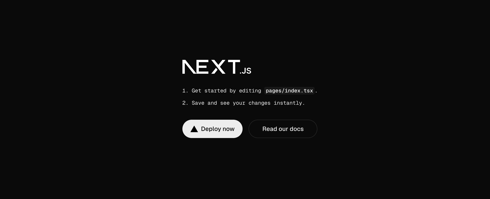
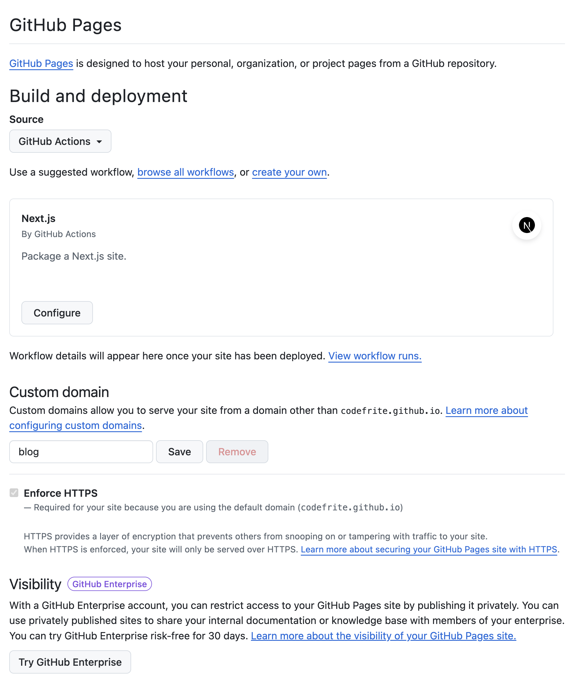
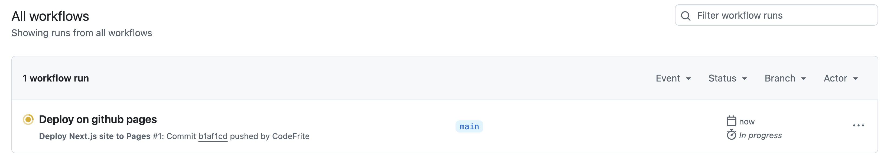

# Step 1: Project setup and hosting on GitHub Pages

In this part, I'll setup a Next.js project and host it on GitHub Pages, nothing more. Let's get started!

I first create a new repo on Github named `blog`. Then, I initialize a new Next.js project on my local using npx and use Typescript as my language of choice, ESLint for code formatting, no tailwing css, no src folder since i'll be using components & hooks folder instead, no particular routing nor custom import statement, the `@` alias being enough for this simple project

```bash
% % npx create-next-app blog
✔ Would you like to use TypeScript? … No / Yes
✔ Would you like to use ESLint? … No / Yes
✔ Would you like to use Tailwind CSS? … No / Yes
✔ Would you like your code inside a `src/` directory? … No / Yes
✔ Would you like to use App Router? (recommended) … No / Yes
✔ Would you like to use Turbopack for next dev? … No / Yes
✔ Would you like to customize the import alias (@/* by default)? … No / Yes
Creating a new Next.js app in /Users/codefrite/Desktop/CODE/blog/blog.

Using npm.

Initializing project with template: default


Installing dependencies:
- react
- react-dom
- next

Installing devDependencies:
- typescript
- @types/node
- @types/react
- @types/react-dom
- eslint
- eslint-config-next

added 297 packages, and audited 298 packages in 11s

117 packages are looking for funding
  run `npm fund` for details

found 0 vulnerabilities
Success! Created blog at xxx/CODE/blog
```

Before commiting anything, I make sure that the current version of npx generated next.js boiler plate is working by running the development server

```bash
% cd blog
% npm run dev
```

I can now open my browser and navigate to `http://localhost:3000` to see the default next.js page:



I can now init my git repository, add all the files, link my local to my remote repository and push my code to Github

```bash
% git init
% git add .
% git commit -m "Initial commit after initializing the next-js project"
% git remote add origin https://github.com/CodeFrite/blog.git
% git branch -M main
% git push -u origin main
```

Now it is time to deploy the project on Github Pages using the default Next.js GitHub Action to build, deploy and host the application:



We can now wait for github to build and deploy the project:



Once done, the page is available at `github-page-deployment-in-progress.png`
