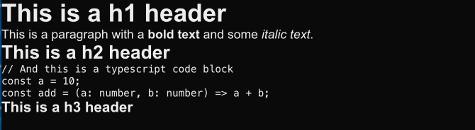
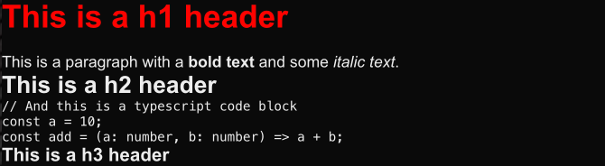

# Rendering md files with MDX integration logic

In this step, we will be setting up the blog to render markdown files as blog posts using MDX. MDX is a markdown syntax that allows to embed JSX components within markdown files. This will allow us to write markdown files and render them as React components.

## Installing the dependencies

First, we need to install next.js MDX dependencies:

```bash
% npm install @next/mdx @mdx-js/loader @mdx-js/react @types/mdx --legacy-peer-deps
```

## Updating the next.config.js file

Next, we need to update the `next.config.js` file to add the MDX loader. For now, I will only be using remark markdown plugin to add support for github flavored md files.

We first need to import the plugin:

```bash
% npm install remark-gfm
```

Then, we can update the `next.config.ts` file as follows:

```typescript
import remarkGfm from "remark-gfm";
import createMDX from "@next/mdx";

/** @type {import('next').NextConfig} */
const nextConfig = {
  // Configure `pageExtensions` to include markdown and MDX files
  pageExtensions: ["js", "jsx", "ts", "tsx", "md", "mdx"],
  // Optionally, add any other Next.js config below
};

const withMDX = createMDX({
  // Add markdown plugins here, as desired
  options: {
    remarkPlugins: [remarkGfm],
    rehypePlugins: [],
  },
});

// Merge MDX config with Next.js config
export default withMDX(nextConfig);
```

## Checking the MDX integration

I can now add a `posts` folder in the `pages`folder in which I'll add my blog posts as `.mdx` files. Let's navigate to my test markdown file `pages/posts/test.mdx` and check if the MDX integration is working properly.



## Adding styling to MDX files

In order to style the MDX files, we need to add a `mdx-components.tsx` file at the root of the project folder. This is where the next/mdx plugin will look to see if we have defined any custom component:

```tsx
import type { MDXComponents } from "mdx/types";

export function useMDXComponents(components: MDXComponents): MDXComponents {
  return {
    h1: (props) => (
      <>
        <h1 style={{ color: "red" }} {...props} />
        <br />
      </>
    ),
    ...components,
  };
}
```

I have added a test custom style for the `h1` tag to check if the integration is working properly. It formats the `h1` tag to have a red color and adds a line break after the tag.



With this, we are now all setup to begin looking to listing all posts and navigating to a post in the next step.
